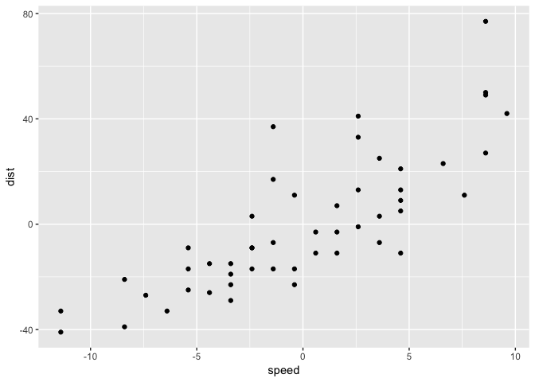
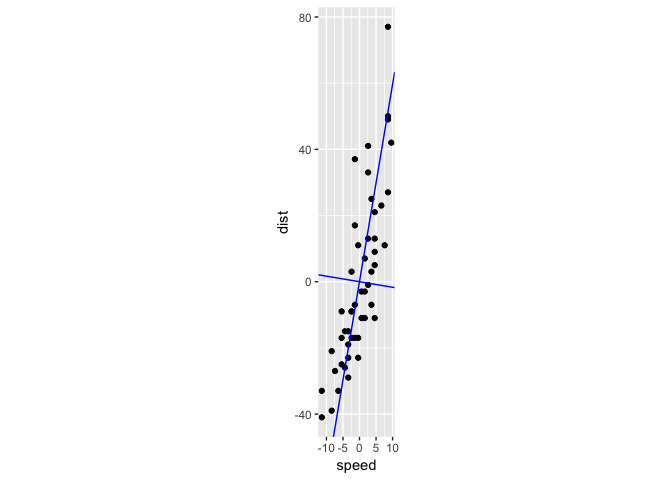
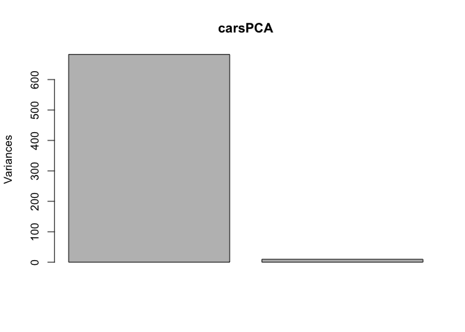
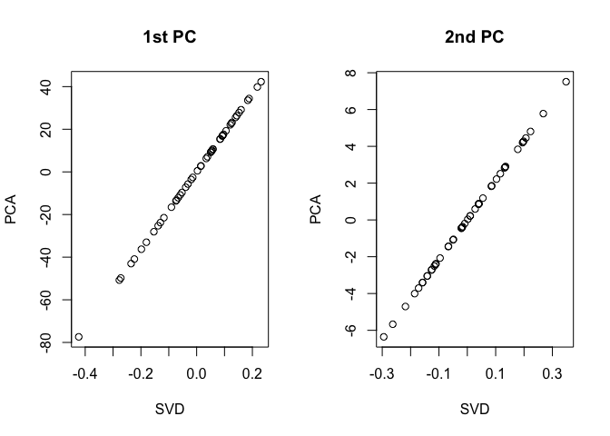
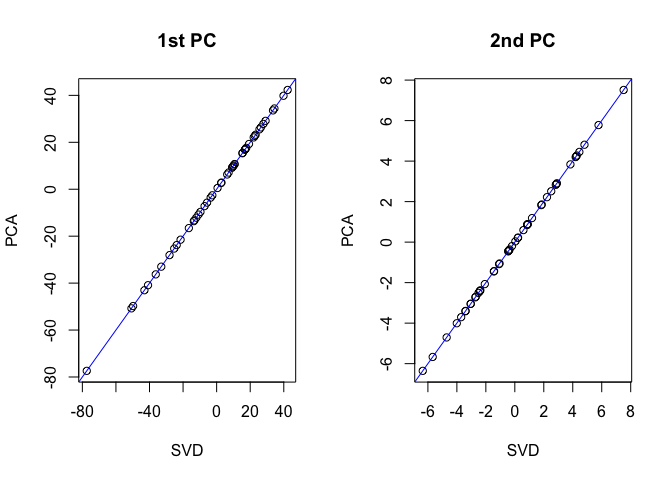

Otago Study Group: PCA, SVD and MDS
================
Mik Black
14/11/2017

### Dimension reduction

There are many situations where it is useful to reduce the
dimensionality of our data, particularly in genetics and genomics, when
it is common to have (up to) millions of variables measured per subject.

A number of statistical tools exist to perform dimension reduction.
Three of the more commonly used tools are:

  - Principal components analysis (PCA)
  - Singular Value Decomposition (SVD)
  - Multi-Dimensional Scaling (MDS)

We’ll look at each of these in turn, but first let’s recap some basic
linear alegbra theory.

### Linear algebra

In statistics, a lot of our analysis is accomplished by fitting linear
models behind the scenes (i.e., inside our statistical software). This
is accomplished via “linear algebra” - the mathematical manipulation of
vectors and matrices.

In a linear model, our data are often represented as an \(n\)
(row/samples) by \(m\) (columns/variables) matrix, \(X\).

For example, in the cars data set, our \(X\) matrix would be 50 x 2 (50
samples, and 2 variables: `dist` and `speed`):

``` r
data(cars)
dim(cars)
```

    ## [1] 50  2

``` r
head(cars)
```

    ##   speed dist
    ## 1     4    2
    ## 2     4   10
    ## 3     7    4
    ## 4     7   22
    ## 5     8   16
    ## 6     9   10

In R, the cars data set is stored as a data frame, but since it is
numeric data, it can easily be converted to a matrix:

``` r
carsMat <- as.matrix(cars)
head(carsMat)
```

    ##      speed dist
    ## [1,]     4    2
    ## [2,]     4   10
    ## [3,]     7    4
    ## [4,]     7   22
    ## [5,]     8   16
    ## [6,]     9   10

``` r
dim(carsMat)
```

    ## [1] 50  2

``` r
class(carsMat)
```

    ## [1] "matrix"

``` r
class(cars)
```

    ## [1] "data.frame"

In R, linear algebra operations can be performed on matrices. For
example, the operation

\[
X^\prime X
\]

flips the \(X\) matrix on its side (transpose) and then multiples it by
\(X\). In R this can be accomplihsed via:

``` r
X <- scale(carsMat, scale=FALSE)
t(X) %*% X 
```

    ##        speed     dist
    ## speed 1370.0  5387.40
    ## dist  5387.4 32538.98

Coincidentally (or not…) if you mean centre the data (using the `scale`
function), and then divide by \(n-1\), you get the *covariance matrix*.

``` r
Xscale <- scale(carsMat, scale=FALSE)
n <- nrow(Xscale)
t(Xscale) %*% Xscale / (n-1)
```

    ##           speed     dist
    ## speed  27.95918 109.9469
    ## dist  109.94694 664.0608

Here is the covariance matrix, which contains the variances of each
variable (`dist` and `speed`) on the diagonal, and the covariance on the
off-diagonal:

``` r
cov(cars)
```

    ##           speed     dist
    ## speed  27.95918 109.9469
    ## dist  109.94694 664.0608

And just as a reminder, the variance of a variable is the square of the
standard deviation:

``` r
var(cars$dist)
```

    ## [1] 664.0608

``` r
sd(cars$dist)^2
```

    ## [1] 664.0608

and the covariance is a component of the correlation between two
variables:

\[
Cor(x,y) = \frac{Cov(x,y)}{s_x s_y}
\]

``` r
cor(cars)
```

    ##           speed      dist
    ## speed 1.0000000 0.8068949
    ## dist  0.8068949 1.0000000

``` r
cov(cars)
```

    ##           speed     dist
    ## speed  27.95918 109.9469
    ## dist  109.94694 664.0608

``` r
cov(cars)[1,2] / sqrt( cov(cars)[1,1] * cov(cars)[2,2])
```

    ## [1] 0.8068949

The *spectral decomposition* (or *eigendecomposition*) is an important
linear algebra technique that can be used to decompose a special kind of
square (i.e., number of rows is equal to the number of columns) matrix
(symmetric, positive definite) in the following way:

\[
X = Z^\prime D Z
\]

where \(D\) is a diagonal matrix (all zeros on the off-diagional
elements), and \(Z\) has the property that

\[
Z^\prime Z = I
\]

where \(I\) is the identity matrix (a diagonal matrix with ones on the
diagonal).

Actually there is a more general form of the spectral decomposition that
doesn’t require symmetry, but that can be a story for another session…

We can apply the spectral decomposition to the covariance matrix for the
cars data via:

``` r
eigen(cov(cars))
```

    ## eigen() decomposition
    ## $values
    ## [1] 682.528426   9.491574
    ## 
    ## $vectors
    ##           [,1]       [,2]
    ## [1,] 0.1656479 -0.9861850
    ## [2,] 0.9861850  0.1656479

The output contains two components:

  - `values`: the *eigenvalues* of the covariance matrix
  - `vectors`: the *eigenvectors* of the covariance matrix

### Wait a minute…

Two immediate questions:

1.  How did we suddenly get to “eigenvectors” and “eigenvalues”?

2.  What are eigenvalues and eigenvectors?

Two immedidate answers:

1.  I just snuck them in when you weren’t looking.

2.  I’m glad you asked. Read on:

Each eigenvector (\(\bf{z}\)) and its corresponding eigenvalue (\(d\))
satisfy the following equation:

\[
X\bf{z} = \it{d}\bf{z} 
\]

Before we had computers to do it for us, being able to decompose a
matrix into the \(X = Z^\prime D Z\) form made matrix algebra a lot
easier, due to some special properties of the \(Z\) matrix.

### Principal components analysis

So, how does all of this relate to principal components analysis (PCA)?

Have a look at this equation:

\[
Y_1 = \alpha_1 X_1 + \alpha_2 X_2
\]

The coefficients \(\alpha_1\) and \(\alpha_2\) are being used to create
a new variable \(Y_1\), which is a *linear combination* of our two
existing variables, \(X_1\) (`dist`) and \(X_2\) (`speed`). In PCA, it
turns out that the goal is to find values of \(\alpha_1\) and
\(\alpha_2\) that create a \(Y_1\) variable whose variance is as large
as possible. To stop the variance going to infinity, we put constraints
on the \(\alpha\)’s:

\[
\alpha_1^2 + \alpha_2^2 = 1
\]

So the variance of \(Y_1\) is as large as possible, subject to those
constraints. Choosing \(\alpha_1 = 1\) and \(\alpha_2 = 0\) gives

\[
Y_1 = \alpha_1 X_1 + \alpha_2 X_2 = 1\times X_1 + 0\times X_2 = X_1
\]

so \(Var(Y_1) = Var(X_1)\):

``` r
var(cars$dist)
```

    ## [1] 664.0608

If we choose \(\alpha_1 = 0.1656479\) and \(\alpha_2 = 0.9861850\) we
get (note the need to use the mean-centered data):

``` r
y1 <- 0.1656479 * Xscale[,1]  +  0.9861850 * Xscale[,2]
var(y1)
```

    ## [1] 682.5285

Check constraint:

``` r
0.1656479^2  +  0.9861850^2
```

    ## [1] 1

Lets have a look at the spectral decomposition data again:

``` r
## NB - centred and uncentred data have the same covariance matrix
eigen(cov(cars))
```

    ## eigen() decomposition
    ## $values
    ## [1] 682.528426   9.491574
    ## 
    ## $vectors
    ##           [,1]       [,2]
    ## [1,] 0.1656479 -0.9861850
    ## [2,] 0.9861850  0.1656479

``` r
eigen(cov(Xscale))
```

    ## eigen() decomposition
    ## $values
    ## [1] 682.528426   9.491574
    ## 
    ## $vectors
    ##           [,1]       [,2]
    ## [1,] 0.1656479 -0.9861850
    ## [2,] 0.9861850  0.1656479

So, the variance for \(Y_1\) that we get when using the values from the
first column of the `vectors` object as our \(\alpha\)’s, is the same as
the value we get as the first entry of the `values` object.

That is:

  - the first *eigenvector* of the covariance matrix defines the linear
    combination of the columns of \(X\) (our `dist` and `speed`
    variables) that yield the largest possible variance (under the
    \(\alpha_1^2 + \alpha_2^2 = 1\) constraint).
  - the first *eigenvalue* gives the size of the variance that is
    achieved.

The second eigenvector and eigenvalue then achieve the same thing, but
in a direction perpendicular (orthogonal) to the direction of the first
eigenvector.

What does this mean in terms of the (mean-centred) cars data?

``` r
library(ggplot2)
```

    ## Registered S3 methods overwritten by 'ggplot2':
    ##   method         from 
    ##   [.quosures     rlang
    ##   c.quosures     rlang
    ##   print.quosures rlang

``` r
library(dplyr)
```

    ## 
    ## Attaching package: 'dplyr'

    ## The following objects are masked from 'package:stats':
    ## 
    ##     filter, lag

    ## The following objects are masked from 'package:base':
    ## 
    ##     intersect, setdiff, setequal, union

``` r
carsScale <- cars %>% scale(, scale=FALSE) %>% as.data.frame()
ggplot(carsScale, aes(x=speed, y=dist)) + geom_point() 
```

<!-- -->

We can add the eigenvector data via:

``` r
eigen(cov(carsScale))
```

    ## eigen() decomposition
    ## $values
    ## [1] 682.528426   9.491574
    ## 
    ## $vectors
    ##           [,1]       [,2]
    ## [1,] 0.1656479 -0.9861850
    ## [2,] 0.9861850  0.1656479

``` r
slope1 <- 0.9861850 / 0.1656479
slope2 <- -0.1656479 / 0.9861850 
ggplot(carsScale, aes(x=speed, y=dist)) + 
  geom_point() +
  geom_abline(intercept=0, slope = slope1, col='blue') + 
  geom_abline(intercept=0, slope = slope2, col='blue') +
  coord_fixed()
```

<!-- -->

Note that the `coord_fixed()` option abpove preserves the aspect ratio
of the plot (otherwise the eigenvectors don’t look orthogonal).

Clearly the first eigenvector is capturing the direction of greatest
variation in the `speed` and `dist` variables.

### Principal components analysis in R

PCA generates “principal components” of the data - linear combinations
of the (centered) variables that explain the observed variation.

In R we can perform PCA via the `prcomp` command:

``` r
carsPCA <- prcomp(cars)
summary(carsPCA)
```

    ## Importance of components:
    ##                            PC1     PC2
    ## Standard deviation     26.1252 3.08084
    ## Proportion of Variance  0.9863 0.01372
    ## Cumulative Proportion   0.9863 1.00000

What else does the `prcomp` command produce?

``` r
names(carsPCA)
```

    ## [1] "sdev"     "rotation" "center"   "scale"    "x"

``` r
carsPCA$rotation
```

    ##              PC1        PC2
    ## speed -0.1656479 -0.9861850
    ## dist  -0.9861850  0.1656479

Some of these numbers should look familiar….

``` r
eigen(cov(cars))
```

    ## eigen() decomposition
    ## $values
    ## [1] 682.528426   9.491574
    ## 
    ## $vectors
    ##           [,1]       [,2]
    ## [1,] 0.1656479 -0.9861850
    ## [2,] 0.9861850  0.1656479

``` r
sqrt(eigen(cov(cars))$values)
```

    ## [1] 26.12524  3.08084

It turns out that PCA is just applying the spectral decomposition to the
covariance matrix of the data to identify the principal components
(eigenvectors). When PCA lists the “Proportion of Variance” explained by
each PC, this again relates to the values calculated from the spectral
decomposition:

``` r
## Proportion of total variance attributed to each eigenvector:
eigen(cov(cars))$values / sum(eigen(cov(cars))$values)
```

    ## [1] 0.98628425 0.01371575

``` r
## Proportion of variance explained by PC's:
summary(carsPCA)
```

    ## Importance of components:
    ##                            PC1     PC2
    ## Standard deviation     26.1252 3.08084
    ## Proportion of Variance  0.9863 0.01372
    ## Cumulative Proportion   0.9863 1.00000

People often use a “scree plot” to show the amount of variation
explained by each PC:

``` r
screeplot(carsPCA)
```

<!-- -->

In data sets with large numbers of variables, this can be used to help
choose the number of PC’s used to explain a desired proportion of
variance.

### Singular Value Decomposition (SVD)

SVD is an extension of the spectral decomposition described above.
Instead of requiring a square positive definite matrix, it can be used
with a rectangular matrix (n \> m).

\[
X = UDV^\prime
\]

\(U\) are refered to the “left eigenvectors” of \(X\) and \(V\) the
“right eigenvectors”.

In R we can generate the SVD via (note used of mean-centered data):

``` r
carsSVD <- svd(carsScale)
names(carsSVD)
```

    ## [1] "d" "u" "v"

``` r
dim(carsSVD$u)
```

    ## [1] 50  2

``` r
head(carsSVD$u)
```

    ##           [,1]       [,2]
    ## [1,] 0.2313156 0.20654191
    ## [2,] 0.1881747 0.26799005
    ## [3,] 0.2178130 0.08471710
    ## [4,] 0.1207458 0.22297542
    ## [5,] 0.1521958 0.13116036
    ## [6,] 0.1836457 0.03934531

``` r
carsSVD$d
```

    ## [1] 182.87671  21.56588

``` r
dim(carsSVD$v)
```

    ## [1] 2 2

``` r
carsSVD$v
```

    ##            [,1]       [,2]
    ## [1,] -0.1656479 -0.9861850
    ## [2,] -0.9861850  0.1656479

Note the values of \(V\) above - aside form the minus signs, these are
identical to the `rotation` output from `prcomp` (note that these are
often called “loadings” in PCA) and the `vector` outputs from the
spectral decomposition of the covariance matrix.

It turns out that the left eigenvectors we get from SVD (i.e., the \(U\)
matrix) are *proportional to* the eigenvectors we get from PCA:

``` r
par(mfrow=c(1,2))
plot( carsSVD$u[,1], carsPCA$x[,1], main="1st PC", xlab="SVD", ylab="PCA")
plot( carsSVD$u[,2], carsPCA$x[,2], main="2nd PC", xlab="SVD", ylab="PCA" )
```

<!-- -->

and the porportionality constant for each component is given by the
“singular values” of the \(D\) matrix:

``` r
par(mfrow=c(1,2))
plot( carsSVD$u[,1] * carsSVD$d[1], carsPCA$x[,1], main="1st PC", xlab="SVD", ylab="PCA")
abline(0, 1, col='blue')
plot( carsSVD$u[,2] * carsSVD$d[2], carsPCA$x[,2], main="2nd PC", xlab="SVD", ylab="PCA")
abline(0, 1, col='blue')
```

<!-- -->

That is, calculating \(U\times D\) from SVD returns the principal
components (or just \(U\) can be used, if the scale is unimportant).

### Multidimensional scaling (MDS)

MDS is a technique that takes multi-dimensional data, and uses the
distance between the variables to determine a new set of “transformed”
variables (linear combinations of the orginal ones) that provide a
reasonable represemntation of the original data in a reduced
dimensionality space. For example, it might be possible to capture the
variability of 10 variables using just two or three.

In R, the `cmdscale` command can be used to perform MDS (the ‘c’ is for
‘classical’ MDS). If the distance used in Euclidean, the deafult with
the `dist` function in R, then the resultant transformed variables are
identical to those generated by PCA or SVD (up to the sign of the
variables, positive or negative).

``` r
head(cmdscale(dist(cars)))
```

    ##           [,1]       [,2]
    ## [1,] -42.30225 -4.4542578
    ## [2,] -34.41277 -5.7794410
    ## [3,] -39.83293 -1.8269987
    ## [4,] -22.08160 -4.8086608
    ## [5,] -27.83306 -2.8285885
    ## [6,] -33.58453 -0.8485162

``` r
head(prcomp(cars)$x)
```

    ##           PC1       PC2
    ## [1,] 42.30225 4.4542578
    ## [2,] 34.41277 5.7794410
    ## [3,] 39.83293 1.8269987
    ## [4,] 22.08160 4.8086608
    ## [5,] 27.83306 2.8285885
    ## [6,] 33.58453 0.8485162

### Summary

Basically, all these things are the same\! As long as you use
mean-centred data for SVD, and Euclidean distance for MDS, you will get
the same results as PCA. And all of these things can be derived from the
spectral decomposition of the covariance matrix of the original data.
